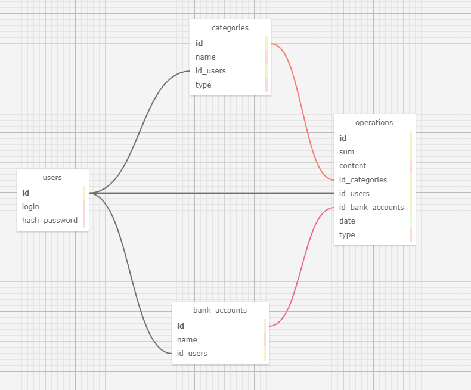

# LiFinance
## Веб-приложение для отслеживания финансов, с использованием базы данных PostgreSQL

## Структура базы данных


## Для работы с базой данных, используется две команды:
```
python manage.py makemigrations
python manage.py migrate
```
Первая команда создает (но не применяет) миграции для всех приложений (либо для конкретного приложения)

Вторая команда применяет изменения