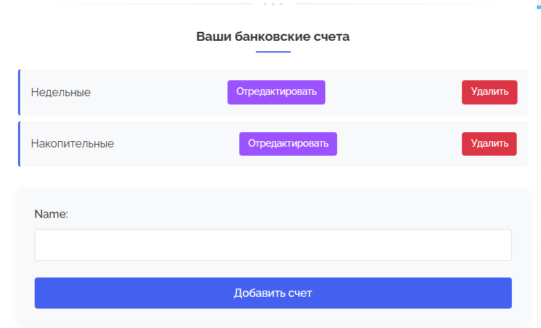

# LiFinance
## Веб-приложение для отслеживания финансов на Django, с использованием базы данных PostgreSQL

## Стек технологий: Python, Django, Docker, PostgreSQL, GIT

## Основная страница


## Добавление/редактирование чека


## История


## Профиль




## Вход и регистрация


## Структура базы данных


## Чтобы начать:
- Настройте переменные окружения в файле .env
- Запустите Docker командой:
```
docker compose up --build
```
- Приложение доступно на сервере localhost:8000


## Особенности: 
- Реализована система аутенфикации 
- История
- Добавление чека
- Динамическое добавление позициий в чек


## Для работы с базой данных, используется две команды:
```
python manage.py makemigrations
python manage.py migrate
```
Первая команда создает (но не применяет) миграции для всех приложений (либо для конкретного приложения)

Вторая команда применяет изменения

## Перспективы:
- Всплывающие сообщения
